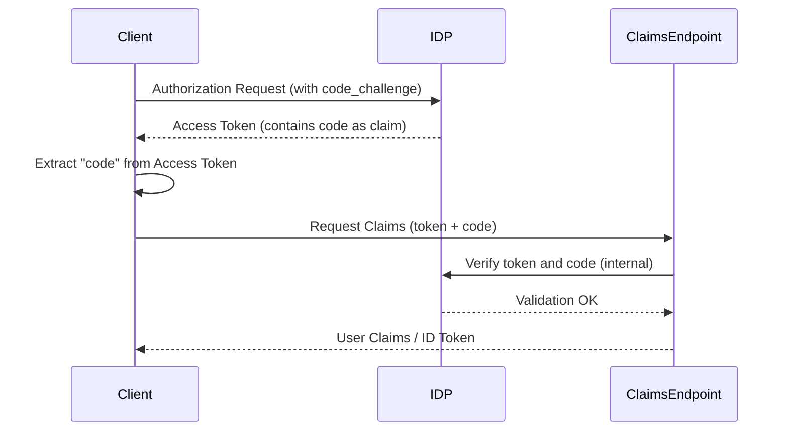

# Custom PKCE Code Flow with Embedded Authorization Code

This document describes a custom implementation of the OAuth 2.0 Authorization Code Flow with PKCE, where the Identity Provider (IDP) returns an **access token that includes the authorization `code` as a claim**. This `code` is later used by the client to retrieve user claims from a dedicated **claims endpoint**.

---

## Flow Overview

This flow modifies the standard PKCE flow in the following way:

- The **authorization server (IDP)** issues an access token that includes an embedded `code` (as a claim).
- The client then uses both the access token and the extracted `code` to request user claims from a custom claims endpoint.

---

## Step-by-Step Flow

### 1. Client Initiates Authorization Request

The client begins by generating a `code_verifier` and corresponding `code_challenge`, then redirects the user to the IDP with a standard authorization request.

**Request:**
```
GET /authorize?
  response_type=token
  &client_id=your-client-id
  &redirect_uri=https://yourapp.com/callback
  &code_challenge=xyz123
  &code_challenge_method=S256
  &state=abc123
```

---

### 2. IDP Returns Access Token with Embedded Code

Upon user authentication, the IDP returns an **access token** (JWT) in the redirect response. This token includes a custom claim named `"code"`.

**Response:**
```json
{
  "access_token": "eyJhbGciOiJIUzI1NiIsInR...",
  "token_type": "Bearer",
  "expires_in": 3600
}
```

Decoded JWT example:
```json
{
  "sub": "user123",
  "scope": "openid profile",
  "code": "abcxyzcode123"  // <-- Embedded authorization code
}
```

---

### 3. Client Extracts Code from Access Token

The client parses the access token, extracts the `"code"` claim, and prepares a request to the claims endpoint.

---

### 4. Client Requests Claims Using Code

The client sends the access token and extracted code to a **custom claims endpoint**.

**POST /claims**
```http
Authorization: Bearer eyJhbGciOi...
Content-Type: application/json

{
  "code": "abcxyzcode123"
}
```

---

### 5. IDP Verifies Code and Returns Claims

The IDP validates the access token and the embedded code, then returns user claims or an ID token.

**Response:**
```json
{
  "sub": "user123",
  "name": "Alice Example",
  "email": "alice@example.com",
  "roles": ["user", "admin"]
}
```

---

## Sequence Diagram



---

## Notes

- The `"code"` claim is treated as a one-time-use artifact to fetch user identity data securely.
- Ensure the access token is validated (signature, expiry) before extracting the `"code"` claim.
- This approach merges the concepts of authorization and identity flows for tightly scoped access use cases.

---

## Security Considerations

- Use HTTPS for all interactions.
- The access token should be signed and possibly encrypted.
- Validate the `aud`, `iss`, `exp`, and `code` claims before use.
- The claims endpoint should check that the token and code pair are valid and haven't been reused.

---

## Compatibility

This is **not a standard OAuth 2.0 flow** and may require custom client and server implementation. Not all OAuth libraries or providers will support it out-of-the-box.

---
